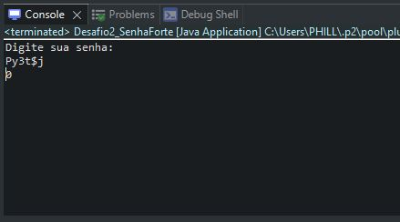
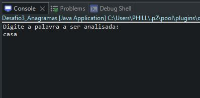
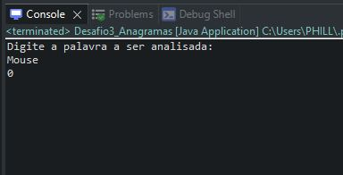

<h1> Academia Capgemini 2022</h1>

<h2>Desafios de programação - Phillip Marques Silva</h2>

Desafios para testar os conhecimentos em lógica de programação, contento 3 questões com diferentes níveis de dificuldade.

<ol> <h3>Pré-requisitos:</h3>
    <li> Java 11 ou versão superior;</li>
    <li> Eclipse ou IDE de sua preferência;</li>
    <li> Fazer o clone/download do projeto na maquina local;</li>
    <li> Abrir o projeto na IDE Java.</li>
</ol>

<ol> <h3>Questão 1:</h3>
    <li>Abrir a classe Desafio1_Escada:</li>
    
    <li>Na classe, clicar com o botão direito e ir ate a opção "Run As"e selecionar a opção "Java Application":</li>
    
    <li>No console, irá aparecer o texto "Qual o tamanho da escada?", abaixo do texto colocar qualquer valor inteiro de sua escolha e apertar "Enter":</li>
    
    <li>Aguardar a resposta:</li>
    
</ol>

<ol> <h3>Questão 2:</h3>
    <li>Abrir a classe Desafio2_SenhaForte:</li>
    
    <li>Na classe, clicar com o botão direito e ir ate a opção "Run As"e selecionar a opção "Java Application":</li>
    
    <li>No console, irá aparecer o texto "Digite sua senha:", abaixo do texto colocar a String que representa a senha e apertar "Enter":</li>
    
    <li>Caso a senha não atenda os parametros, aparecera um inteiro com o valor de caracteres necessarios para a senha ser aceita:</li>
    
    <li>Caso a senha seja aceita, o console retornará zero:</li>
    
</ol>

<ol> <h3>Questão 3:</h3>
    <li>Abrir a classe Desafio3_Anagramas:</li>
    
    <li>Na classe, clicar com o botão direito e ir ate a opção "Run As"e selecionar a opção "Java Application":</li>
    
    <li>No console, irá aparecer o texto "Digite a palavra a ser analisada:", abaixo do texto colocar a palavra para análise e apertar "Enter":</li>
    
    <li>Caso a palavra possua anagramas, o console irá retorna a quantidade de anagramas presentes:</li>
    
    <li>Caso a palavra não tenha anagramas, o console retornará zero:</li>
    
</ol>